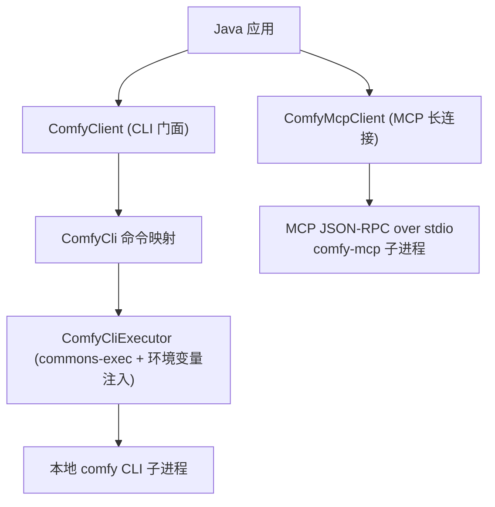

# comfy-java-sdk

[English](./README.md) | [简体中文](./README.zh-CN.md)

[](https://github.com/easy-4-java/comfy-java-sdk) [](https://www.apache.org/licenses/LICENSE-2.0.txt)

> Java SDK for the [Comfy CLI](https://docs.comfy.org/agent-tools/cli): a
> subprocess wrapper for `comfy-cli` (setup, cloud auth, generation, workflow,
> discovery, skills) plus an MCP stdio client for `comfy-mcp`.

## Table of Contents

- [1. Project Overview](#1-project-overview)
- [2. Features & Status](#2-features--status)
- [3. Requirements & Compatibility](#3-requirements--compatibility)
- [4. Architecture & Modules](#4-architecture--modules)
- [5. Installation](#5-installation)
- [6. Quick Start](#6-quick-start)
- [7. Configuration](#7-configuration)
- [8. Core Usage / API](#8-core-usage--api)
- [9. Testing & Build](#9-testing--build)
- [10. Versioning & Branches](#10-versioning--branches)
- [11. Contributing & License](#11-contributing--license)

## 1. Project Overview

`comfy-java-sdk` lets Java applications integrate the Comfy CLI (`comfy`)
through two routes. It is a **CLI wrapper + MCP client**, not a direct Comfy
Cloud HTTP API client.

- **CLI route (local subprocess)** — every call maps to a real `comfy`
  command line invocation.
- **MCP route (long connection)** — spawns `comfy-mcp` and drives it over
  JSON-RPC on stdio (the MCP stdio transport): initialize → tools/list →
  tools/call. Pure process pipes, so it works on every supported JDK.

The SDK covers:

- **Generation** — `comfy generate <model>` with the full documented flag set
  (prompt/width/height/download/image/mask/resolution/duration/aspect_ratio/
  rendering_speed/async/json/where), plus `generate list | schema | upload |
  resume`.
- **ComfyUI lifecycle** — `install`, `launch`, `stop`, `update`,
  `set-default --where`.
- **Cloud auth** — `cloud login`, `cloud whoami`; API keys travel via the
  `COMFY_API_KEY` environment variable (never argv).
- **Workflow & discovery** — `run`, `jobs`, `validate`, `workflow`,
  `templates`, `nodes`, `models`, `--json discover`.
- **Skills** — `skills install | list | status`.
- **MCP tools** — `initialize` handshake, `tools/list`, `tools/call` with
  text-content accumulation and `isError` surfacing; `server_info`
  convenience.

What it is **not**:

- Not a Comfy Cloud HTTP API client (the hosted `https://cloud.comfy.org/mcp`
  endpoint is out of scope; point your own MCP stack at it or use the local
  route).
- Not a replacement for the `comfy` binary / `comfy-mcp` package — they must
  be installed and runnable.

Typical scenarios:

| Scenario | What you use |
| :--- | :--- |
| One-shot image/video generation | `ComfyClient.generateJson(model, options)` |
| Verify a local ComfyUI is up | `ComfyMcpClient.callTool("server_info", null)` |
| Run a workflow file headlessly | `cli.run("--workflow", "wf.json")` or MCP `run_workflow` |
| Discover models/nodes/templates | `cli.nodes(...)` / `cli.models(...)` / MCP `search_templates` |
| Wire agent skills into the workspace | `skillsInstall()` |

## 2. Features & Status

| Capability | Status | Notes |
| :--- | :--- | :--- |
| Generation family | Active development | `generate(model, options)`, `generateList`, `generateSchema`, `generateUpload`, `generateResume` |
| ComfyUI lifecycle | Active development | `install`, `launch`, `stop`, `update`, `set-default --where` |
| Cloud auth | Active development | `cloudLogin`, `cloudWhoami`; `COMFY_API_KEY` via environment |
| Workflow & discovery | Active development | `run`, `jobs`, `validate`, `workflow`, `templates`, `nodes`, `models`, `--json discover` |
| Skills | Active development | `skillsInstall`, `skillsList`, `skillsStatus` |
| MCP route | Active development | `initialize`, `tools/list`, `tools/call`, `server_info` convenience, bounded frame/content caps |
| Comfy Cloud MCP (remote HTTP) | Not yet | point your own MCP stack at `https://cloud.comfy.org/mcp` |

> **Assumption**: capability statuses reflect the documented comfy CLI
> surface at the time of writing (`comfy generate` is beta upstream — flags
> may change); the module is under active development.

## 3. Requirements & Compatibility

| Requirement | Version / Notes |
| :--- | :--- |
| JDK | 21+ (this branch) |
| Maven | wrapper included (`./mvnw`, Maven 4) |
| comfy-cli | must be installed and on PATH (`localExecutable` configures the path) |
| comfy-mcp | only for the MCP route (`pip install comfy-mcp`; `COMFY_BIN` env for the workspace binary) |

Version lines:

| Branch | JDK | Version |
| :--- | :--- | :--- |
| `feature/1.0.x` | 8 | `1.0.x.*` |
| `feature/2.0.x` | 17 | `2.0.x.*` |
| `feature/3.0.x` | 21 | `3.0.x.*` |

> All three lines ship the same two routes — the MCP client uses plain
> process pipes, so it is not restricted to newer JDKs.

## 4. Architecture & Modules



Single-module Maven project (`packaging: jar`).

| Package | Contents |
| :--- | :--- |
| `io.github.easy4j.comfy` | `ComfyClient`, `ComfyClientConfig`, `ComfyException` |
| `io.github.easy4j.comfy.cli` | `ComfyCli`, `ComfyCliExecutor`, `ComfyCliResult` |
| `io.github.easy4j.comfy.mcp` | `ComfyMcpClient`, `ComfyMcpConfig`, `ComfyMcpTool`, `ComfyMcpCallResult` |

## 5. Installation

Snapshots are distributed through the Aliyun Maven repository; releases also
land on GitHub Releases.

```xml
<dependency>
    <groupId>io.github.easy4j</groupId>
    <artifactId>comfy-java-sdk</artifactId>
    <version>3.0.x.20260630-SNAPSHOT</version>
</dependency>
```

## 6. Quick Start

```java
import io.github.easy4j.comfy.ComfyClient;
import io.github.easy4j.comfy.ComfyClientConfig;
import io.github.easy4j.comfy.cli.ComfyCli;

public class ComfyDemo {

    public static void main(String[] args) {
        ComfyClientConfig config = new ComfyClientConfig();
        config.setLocalExecutable("comfy");
        config.setDefaultWhere("cloud");
        config.getEnvironment(); // see setEnvironment below
        java.util.Map<String, String> env = new java.util.LinkedHashMap<String, String>();
        env.put("COMFY_API_KEY", System.getenv("COMFY_API_KEY"));
        config.setEnvironment(env);

        try (ComfyClient client = new ComfyClient(config)) {
            ComfyCli.GenerateOptions options = new ComfyCli.GenerateOptions()
                    .prompt("a cat on the moon, cinematic lighting")
                    .width(1024).height(1024)
                    .download("cat.png");
            System.out.println(client.generateJson("flux-pro", options));
        }
    }
}
```

## 7. Configuration

### 7.1 `ComfyClientConfig` (CLI route)

| Field | Type | Default | Description |
| :--- | :--- | :--- | :--- |
| `localExecutable` | String | `comfy` | CLI executable name or absolute path |
| `environment` | Map | - | Extra child env vars (`COMFY_API_KEY`, `COMFY_WHERE`); merged over the parent env |
| `localTimeoutSeconds` | int | `600` | Command execution timeout (generation runs can be long) |
| `localProbeTimeoutSeconds` | int | `5` | Availability probe timeout (seconds) |
| `defaultWhere` | String | - | `local` or `cloud`; forwarded as `--where` when set |

### 7.2 `ComfyMcpConfig` (MCP route)

| Field | Type | Default | Description |
| :--- | :--- | :--- | :--- |
| `localExecutable` | String | `comfy-mcp` | MCP server executable |
| `mcpArgs` | String[] | - | Extra server arguments |
| `environment` | Map | - | e.g. `COMFY_BIN=/path/to/venv/bin/comfy` |
| `protocolVersion` | String | `2024-11-05` | MCP protocol version advertised in `initialize` |
| `clientName` / `clientVersion` | String | `comfy-java-sdk` / `1.0.0` | Client identity in `initialize` |
| `connectTimeoutMillis` | int | `10000` | Process startup + `initialize` handshake timeout |
| `readTimeoutMillis` | int | `900000` | Per-`tools/call` upper bound (generation tools run long) |
| `maxFrameChars` | int | `1048576` | Frame hard cap (`<= 0` unbounded) |
| `maxContentChars` | int | `1048576` | Per-call text cap; excess truncated with a warning (`<= 0` unbounded) |

## 8. Core Usage / API

### 8.1 Generation with JSON output

```java
try (ComfyClient client = new ComfyClient(config)) {
    JsonNode json = client.generateJson("flux-pro",
            new ComfyCli.GenerateOptions().prompt("a cat on the moon").width(1024).height(1024));
    System.out.println(json.toPrettyString());
}
```

### 8.2 MCP long-connection route

```java
import io.github.easy4j.comfy.mcp.ComfyMcpCallResult;
import io.github.easy4j.comfy.mcp.ComfyMcpClient;
import io.github.easy4j.comfy.mcp.ComfyMcpConfig;

ComfyMcpConfig mcpConfig = new ComfyMcpConfig();
mcpConfig.setEnvironment(java.util.Collections.singletonMap(
        "COMFY_BIN", "/path/to/venv/bin/comfy"));
try (ComfyMcpClient mcp = new ComfyMcpClient(mcpConfig)) {
    mcp.connect();                                              // initialize + initialized
    mcp.listTools().forEach(t -> System.out.println(t.getName()));
    ComfyMcpCallResult info = mcp.callTool("server_info", null); // verify ComfyUI is up
    System.out.println(info.getText());
}
```

## 9. Testing & Build

```bash
./mvnw clean verify
```

- JaCoCo report + 90% line-coverage `check` goal bound to `verify`
  (`haltOnFailure=false`).
- The MCP route is covered by end-to-end tests against a fake MCP server
  process (python3) speaking the same NDJSON JSON-RPC wire format.

## 10. Versioning & Branches

| Branch | JDK | Version | Notes |
| :--- | :--- | :--- | :--- |
| `feature/1.0.x` | 8 | `1.0.x.*` | Default branch, JDK 8 baseline |
| `feature/2.0.x` | 17 | `2.0.x.*` | JDK 17 line |
| `feature/3.0.x` | 21 | `3.0.x.*` | JDK 21 line |

Maintenance policy: the three branches keep source, tests and READMEs in
sync; only `pom.xml` differs (JDK + Jackson/JUnit lines). Releases go to the
Aliyun Maven repository and GitHub Releases.

## 11. Contributing & License

Contributions are welcome — please open issues or pull requests on GitHub.

Licensed under the [Apache License, Version 2.0](https://www.apache.org/licenses/LICENSE-2.0.txt).
