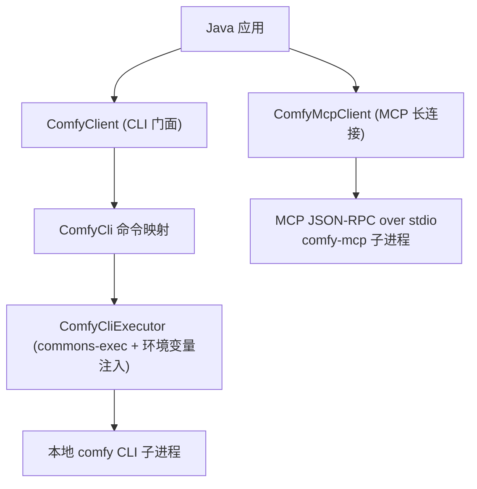

# comfy-java-sdk

[English](./README.md) | [简体中文](./README.zh-CN.md)

[](https://github.com/easy-4-java/comfy-java-sdk) [](https://www.apache.org/licenses/LICENSE-2.0.txt)

> [Comfy CLI](https://docs.comfy.org/agent-tools/cli) 的 Java SDK：`comfy-cli`
> 子进程封装（setup、cloud 认证、生成、工作流、发现、skills）+
> `comfy-mcp` 的 MCP stdio 客户端。

## 目录

- [1. 项目概述](#1-项目概述)
- [2. 功能与状态](#2-功能与状态)
- [3. 环境要求与兼容性](#3-环境要求与兼容性)
- [4. 架构与模块](#4-架构与模块)
- [5. 安装](#5-安装)
- [6. 快速开始](#6-快速开始)
- [7. 配置](#7-配置)
- [8. 核心用法 / API](#8-核心用法--api)
- [9. 测试与构建](#9-测试与构建)
- [10. 版本与分支](#10-版本与分支)
- [11. 贡献与许可](#11-贡献与许可)

## 1. 项目概述

`comfy-java-sdk` 让 Java 应用通过两条路线集成 Comfy CLI（`comfy`）。它是
**CLI 封装 + MCP 客户端**，不是直连 Comfy Cloud HTTP API 客户端。

- **CLI 路线（本地子进程）**——每次调用都对应一次真实的 `comfy` 命令行执行。
- **MCP 路线（长连接）**——拉起 `comfy-mcp`，在 stdio 上以 JSON-RPC 驱动
  （MCP stdio 传输）：initialize → tools/list → tools/call。纯进程管道实现，
  不受 JDK 版本限制。

SDK 覆盖：

- **生成**——`comfy generate <model>` 全量文档旗标
  （prompt/width/height/download/image/mask/resolution/duration/aspect_ratio/
  rendering_speed/async/json/where），以及 `generate list | schema | upload |
  resume`。
- **ComfyUI 生命周期**——`install`、`launch`、`stop`、`update`、
  `set-default --where`。
- **Cloud 认证**——`cloud login`、`cloud whoami`；API key 走
  `COMFY_API_KEY` 环境变量（绝不进 argv）。
- **工作流与发现**——`run`、`jobs`、`validate`、`workflow`、`templates`、
  `nodes`、`models`、`--json discover`。
- **Skills**——`skills install | list | status`。
- **MCP 工具**——`initialize` 握手、`tools/list`、`tools/call`
  （文本内容累积 + `isError` 呈现）；`server_info` 便捷方法。

它不是：

- Comfy Cloud HTTP API 客户端（托管端点 `https://cloud.comfy.org/mcp`
  不在范围内；请用自有 MCP 栈接入，或走本地路线）。
- `comfy` 二进制 / `comfy-mcp` 包的替代品——必须安装且可运行。

典型场景：

| 场景 | 使用内容 |
| :--- | :--- |
| 一次性图/视频生成 | `ComfyClient.generateJson(model, options)` |
| 确认本地 ComfyUI 存活 | `ComfyMcpClient.callTool("server_info", null)` |
| 无头执行工作流文件 | `cli.run("--workflow", "wf.json")` 或 MCP `run_workflow` |
| 发现模型/节点/模板 | `cli.nodes(...)` / `cli.models(...)` / MCP `search_templates` |
| 向工作区安装 agent skills | `skillsInstall()` |

## 2. 功能与状态

| 能力 | 状态 | 说明 |
| :--- | :--- | :--- |
| 生成族 | 活跃开发 | `generate(model, options)`、`generateList`、`generateSchema`、`generateUpload`、`generateResume` |
| ComfyUI 生命周期 | 活跃开发 | `install`、`launch`、`stop`、`update`、`set-default --where` |
| Cloud 认证 | 活跃开发 | `cloudLogin`、`cloudWhoami`；`COMFY_API_KEY` 走环境变量 |
| 工作流与发现 | 活跃开发 | `run`、`jobs`、`validate`、`workflow`、`templates`、`nodes`、`models`、`--json discover` |
| Skills | 活跃开发 | `skillsInstall`、`skillsList`、`skillsStatus` |
| MCP 路线 | 活跃开发 | `initialize`、`tools/list`、`tools/call`、`server_info` 便捷方法、帧/内容上限 |
| Comfy Cloud MCP（远程 HTTP） | 尚未提供 | 用自有 MCP 栈接入 `https://cloud.comfy.org/mcp` |

> **假设**：能力状态反映撰写时的 comfy CLI 文档面（上游 `comfy generate`
> 为 beta，旗标可能变动）；模块处于活跃开发中。

## 3. 环境要求与兼容性

| 要求 | 版本 / 说明 |
| :--- | :--- |
| JDK | 21+（本分支） |
| Maven | 项目自带 wrapper（`./mvnw`，Maven 4） |
| comfy-cli | 必须安装且在 PATH 上（`localExecutable` 可配置路径） |
| comfy-mcp | 仅 MCP 路线需要（`pip install comfy-mcp`；`COMFY_BIN` 指向工作区 comfy 二进制） |

版本线：

| 分支 | JDK | 版本 |
| :--- | :--- | :--- |
| `feature/1.0.x` | 8 | `1.0.x.*` |
| `feature/2.0.x` | 17 | `2.0.x.*` |
| `feature/3.0.x` | 21 | `3.0.x.*` |

> 三条版本线提供相同的两条路线——MCP 客户端基于进程管道，不受新 JDK 限制。

## 4. 架构与模块



单模块 Maven 工程（`packaging: jar`）。

| 包 | 内容 |
| :--- | :--- |
| `io.github.easy4j.comfy` | `ComfyClient`、`ComfyClientConfig`、`ComfyException` |
| `io.github.easy4j.comfy.cli` | `ComfyCli`、`ComfyCliExecutor`、`ComfyCliResult` |
| `io.github.easy4j.comfy.mcp` | `ComfyMcpClient`、`ComfyMcpConfig`、`ComfyMcpTool`、`ComfyMcpCallResult` |

## 5. 安装

快照通过阿里云 Maven 仓库分发；正式版同时发布 GitHub Releases。

```xml
<dependency>
    <groupId>io.github.easy4j</groupId>
    <artifactId>comfy-java-sdk</artifactId>
    <version>3.0.x.20260630-SNAPSHOT</version>
</dependency>
```

## 6. 快速开始

```java
import io.github.easy4j.comfy.ComfyClient;
import io.github.easy4j.comfy.ComfyClientConfig;
import io.github.easy4j.comfy.cli.ComfyCli;

public class ComfyDemo {

    public static void main(String[] args) {
        ComfyClientConfig config = new ComfyClientConfig();
        config.setLocalExecutable("comfy");
        config.setDefaultWhere("cloud");
        java.util.Map<String, String> env = new java.util.LinkedHashMap<String, String>();
        env.put("COMFY_API_KEY", System.getenv("COMFY_API_KEY"));
        config.setEnvironment(env);

        try (ComfyClient client = new ComfyClient(config)) {
            ComfyCli.GenerateOptions options = new ComfyCli.GenerateOptions()
                    .prompt("a cat on the moon, cinematic lighting")
                    .width(1024).height(1024)
                    .download("cat.png");
            System.out.println(client.generateJson("flux-pro", options));
        }
    }
}
```

## 7. 配置

### 7.1 `ComfyClientConfig`（CLI 路线）

| 字段 | 类型 | 默认值 | 说明 |
| :--- | :--- | :--- | :--- |
| `localExecutable` | String | `comfy` | CLI 可执行文件名或绝对路径 |
| `environment` | Map | - | 子进程额外环境变量（`COMFY_API_KEY`、`COMFY_WHERE`），与父环境合并 |
| `localTimeoutSeconds` | int | `600` | 命令执行超时（生成耗时长） |
| `localProbeTimeoutSeconds` | int | `5` | 可用性探测超时（秒） |
| `defaultWhere` | String | - | `local` 或 `cloud`；设置时转发 `--where` |

### 7.2 `ComfyMcpConfig`（MCP 路线）

| 字段 | 类型 | 默认值 | 说明 |
| :--- | :--- | :--- | :--- |
| `localExecutable` | String | `comfy-mcp` | MCP 服务器可执行文件 |
| `mcpArgs` | String[] | - | 服务器额外参数 |
| `environment` | Map | - | 例如 `COMFY_BIN=/path/to/venv/bin/comfy` |
| `protocolVersion` | String | `2024-11-05` | `initialize` 声明的 MCP 协议版本 |
| `clientName` / `clientVersion` | String | `comfy-java-sdk` / `1.0.0` | `initialize` 中的客户端身份 |
| `connectTimeoutMillis` | int | `10000` | 进程启动 + `initialize` 握手超时 |
| `readTimeoutMillis` | int | `900000` | 单次 `tools/call` 上限（生成工具耗时长） |
| `maxFrameChars` | int | `1048576` | 帧硬上限（`<= 0` 不限） |
| `maxContentChars` | int | `1048576` | 单次调用文本上限；超出截断并告警（`<= 0` 不限） |

## 8. 核心用法 / API

### 8.1 带 JSON 输出的生成

```java
try (ComfyClient client = new ComfyClient(config)) {
    JsonNode json = client.generateJson("flux-pro",
            new ComfyCli.GenerateOptions().prompt("a cat on the moon").width(1024).height(1024));
    System.out.println(json.toPrettyString());
}
```

### 8.2 MCP 长连接路线

```java
import io.github.easy4j.comfy.mcp.ComfyMcpCallResult;
import io.github.easy4j.comfy.mcp.ComfyMcpClient;
import io.github.easy4j.comfy.mcp.ComfyMcpConfig;

ComfyMcpConfig mcpConfig = new ComfyMcpConfig();
mcpConfig.setEnvironment(java.util.Collections.singletonMap(
        "COMFY_BIN", "/path/to/venv/bin/comfy"));
try (ComfyMcpClient mcp = new ComfyMcpClient(mcpConfig)) {
    mcp.connect();                                              // initialize + initialized
    mcp.listTools().forEach(t -> System.out.println(t.getName()));
    ComfyMcpCallResult info = mcp.callTool("server_info", null); // 确认 ComfyUI 存活
    System.out.println(info.getText());
}
```

## 9. 测试与构建

```bash
./mvnw clean verify
```

- JaCoCo 报告 + 90% 行覆盖 `check` 目标绑定在 `verify` 阶段
  （`haltOnFailure=false`）。
- MCP 路线由对假 MCP 服务器进程（python3，同线缆格式 NDJSON JSON-RPC）的
  端到端测试覆盖。

## 10. 版本与分支

| 分支 | JDK | 版本 | 说明 |
| :--- | :--- | :--- | :--- |
| `feature/1.0.x` | 8 | `1.0.x.*` | 默认分支，JDK 8 基线 |
| `feature/2.0.x` | 17 | `2.0.x.*` | JDK 17 版本线 |
| `feature/3.0.x` | 21 | `3.0.x.*` | JDK 21 版本线 |

维护策略：三分支保持源码、测试与 README 同步；仅 `pom.xml` 存在差异
（JDK + Jackson/JUnit 线）。发布走阿里云 Maven 仓库与 GitHub Releases。

## 11. 贡献与许可

欢迎通过 GitHub Issue 或 Pull Request 参与贡献。

本项目基于 [Apache License, Version 2.0](https://www.apache.org/licenses/LICENSE-2.0.txt) 许可。
